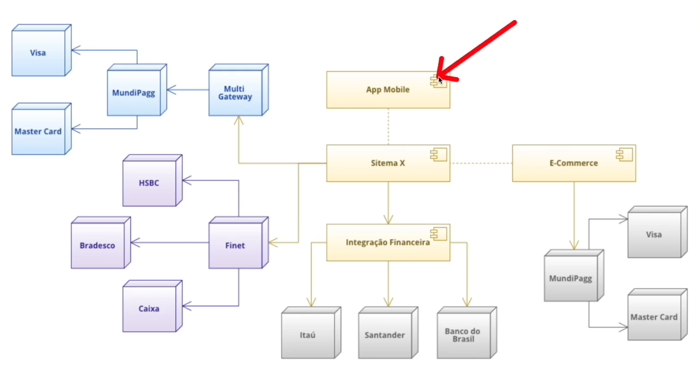
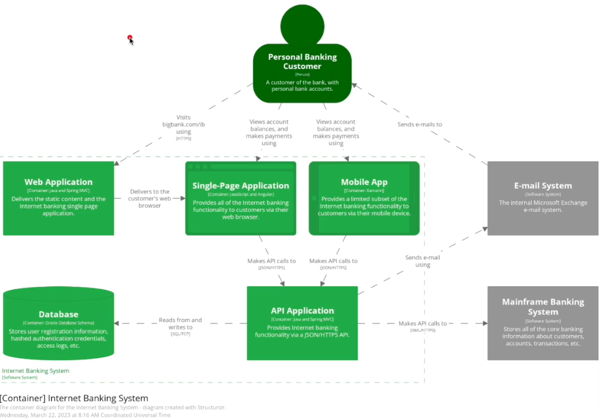
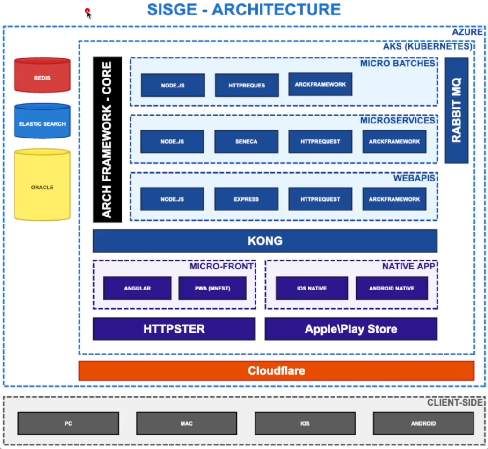

# Niveis de Arquitetura.
## Contextualizando e entendendo os níveis.
## Nível diagrama de componentes.

* App Mobile.
* Sistema X.
* Integração financeira.
* E-Commerce.
* Integrações com gateways de pagamentos.

## Nivel de Arquiterura C4.
### nessa notação	de arquiterura existem 4 níveis.
* Nível de negócio.
* Nível de container.
* Nível de componentes.
* Nível de classe.
  * exemplo de nível de container.
  

## Nivel de Arquiterura MDL.
### É uma notação de arquiterura de baixo nível.
  * Exemplo de uma arquitetura MDL
  

# Estudar depois
* Notações dentro do contexto de arquiterura de software.
    * Notação MDL
    * C4
    * IML
