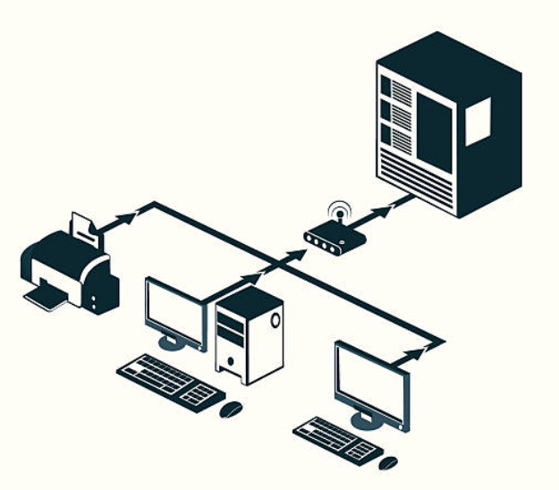
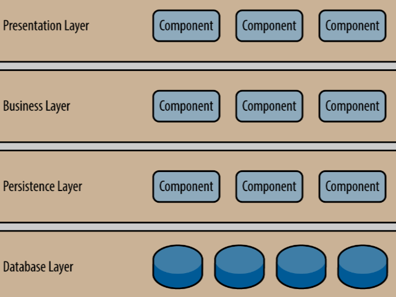
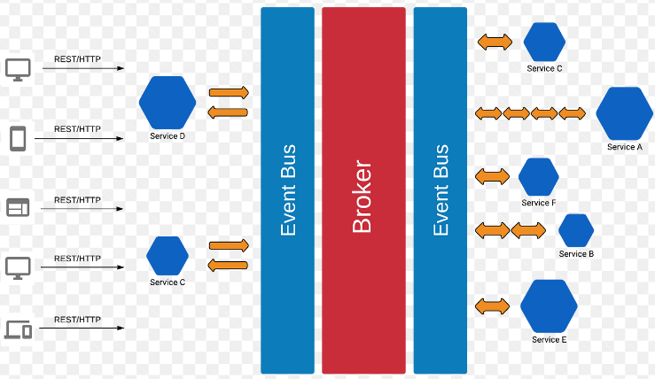
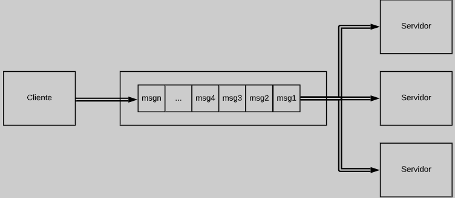

# Estilos e padrões de Arquitetura
Em arquitetura de software, os termos "estilos de arquitetura" e "padrões de arquitetura" referem-se a abordagens e conceitos diferentes, mas relacionados, que ajudam a estruturar e organizar sistemas de software. Aqui estão as principais diferenças entre eles:

1. Estilos de Arquitetura:
   - Estilos de arquitetura são abordagens gerais de design que definem as diretrizes gerais para a organização de componentes e interações em um sistema de software.
   - Eles descrevem os princípios e conceitos fundamentais que guiam a arquitetura de um sistema, mas não especificam detalhes de implementação.
   - Exemplos de estilos de arquitetura incluem arquitetura em camadas, arquitetura cliente-servidor, arquitetura orientada a eventos, arquitetura baseada em microserviços, entre outros.
   - Estilos de arquitetura fornecem um alto nível de abstração e flexibilidade para adaptar-se às necessidades específicas de um sistema.

2. Padrões de Arquitetura:
   - Padrões de arquitetura são soluções específicas para problemas recorrentes de design arquitetônico em sistemas de software.
   - Eles são soluções detalhadas que descrevem como componentes e módulos devem ser organizados para resolver um problema de maneira eficaz.
   - Padrões de arquitetura são derivados de experiências passadas e melhores práticas em design de software, e eles têm um foco mais específico do que os estilos de arquitetura.
   - Exemplos de padrões de arquitetura incluem o padrão MVC (Model-View-Controller), o padrão Singleton, o padrão Observer, o padrão Strategy, entre outros.
   - Padrões de arquitetura são aplicados a componentes individuais ou a partes específicas de um sistema.

Em resumo, os estilos de arquitetura oferecem diretrizes gerais de design e organização para sistemas de software, enquanto os padrões de arquitetura são soluções específicas para problemas de design que podem ser aplicadas dentro de um estilo de arquitetura. Ambos desempenham um papel importante no desenvolvimento de software de alta qualidade, ajudando a criar sistemas que sejam eficientes, escaláveis, manuteníveis e flexíveis.
## Client -> Server
* Mainframe ou Clound ( Servidor ou Infra em nuvem)

A arquitetura de cliente (client-side architecture) refere-se a uma abordagem na qual a maior parte do processamento e lógica de um aplicativo é executada no dispositivo do cliente, geralmente um navegador da web ou um aplicativo móvel. Essa arquitetura é comum em aplicações web e móveis modernas e tem várias vantagens, como uma experiência de usuário mais rápida e responsiva, menos carga no servidor e a capacidade de criar interfaces de usuário dinâmicas e interativas. Vou explicar os principais componentes e características da arquitetura de cliente:

1. **Cliente (Client)**: O cliente refere-se ao dispositivo no qual o aplicativo é executado, como um navegador da web em um computador ou um aplicativo móvel em um smartphone ou tablet.

2. **Interface de Usuário (User Interface - UI)**: A interface de usuário é responsável por exibir informações e interagir com o usuário. No contexto de uma arquitetura de cliente, a interface de usuário é geralmente construída usando tecnologias web, como HTML, CSS e JavaScript, ou tecnologias móveis, como Java ou Swift.

3. **Lógica de Aplicativo (Application Logic)**: Grande parte da lógica de aplicativo reside no cliente. Isso inclui a manipulação de eventos do usuário, validação de entrada, cálculos e atualizações de interface com base nas ações do usuário.

4. **Requisições ao Servidor (Server Requests)**: Embora a maior parte da lógica de aplicativo seja executada no cliente, pode haver momentos em que o cliente precisa interagir com um servidor para buscar dados ou executar operações que não podem ser realizadas localmente. Isso é geralmente feito por meio de solicitações HTTP, como requisições AJAX em aplicações web ou chamadas de API em aplicativos móveis.

5. **Armazenamento de Dados Local (Local Data Storage)**: Os clientes podem armazenar dados localmente, geralmente em bancos de dados locais, cookies, armazenamento local ou IndexedDB (em aplicações web) ou bancos de dados locais (em aplicativos móveis). Isso permite que os aplicativos funcionem offline ou melhorem o desempenho, armazenando em cache informações frequentemente acessadas.

6. **Segurança do Cliente (Client Security)**: A segurança do cliente é fundamental para proteger os dados e garantir que o cliente não seja vulnerável a ataques. As técnicas incluem a validação de entrada, a prevenção de ataques de injeção, a autenticação e autorização adequadas e a proteção contra cross-site scripting (XSS) e outros ataques comuns.

7. **Atualizações de Software (Software Updates)**: Em uma arquitetura de cliente, as atualizações de software podem ser entregues diretamente para o cliente, seja por meio de atualizações automáticas em navegadores web ou atualizações de aplicativos móveis pela loja de aplicativos correspondente. Isso permite aprimorar a funcionalidade e a segurança do aplicativo.

A arquitetura de cliente oferece benefícios notáveis em termos de responsividade e experiência do usuário, mas também apresenta desafios, como a necessidade de lidar com diferentes navegadores e dispositivos, bem como questões de segurança mais complexas. Portanto, é importante equilibrar a lógica no cliente e no servidor de acordo com os requisitos específicos do aplicativo e as considerações de segurança.
## Camadas

A arquitetura de camadas, também conhecida como arquitetura em camadas ou arquitetura em camadas, é um padrão de design de software que organiza um sistema em diferentes camadas ou níveis de abstração, cada uma com responsabilidades específicas e bem definidas. Cada camada se comunica apenas com as camadas imediatamente adjacentes, tornando o sistema mais modular, fácil de entender e manter. Essa abordagem é frequentemente usada em sistemas complexos para melhorar a escalabilidade, a manutenção e a reutilização de código.

As camadas geralmente são organizadas da seguinte forma, da camada mais baixa para a camada mais alta:

1. **Camada de Infraestrutura ou Camada de Acesso a Dados:** Essa é a camada mais baixa e lida com a comunicação direta com o hardware ou com o armazenamento de dados. Ela inclui tarefas como acesso ao banco de dados, leitura/gravação de arquivos e interação com dispositivos de hardware.

2. **Camada de Lógica de Negócios ou Camada de Serviços:** Esta camada é responsável por implementar as regras de negócios do sistema. Ela processa e valida os dados, executa cálculos e toma decisões com base nas regras de negócios definidas. É independente de detalhes de armazenamento de dados ou interface do usuário.

3. **Camada de Apresentação ou Camada de Interface do Usuário:** A camada superior é responsável por apresentar informações ao usuário e capturar entrada do usuário. Ela pode incluir a interface gráfica do usuário (GUI) em aplicativos de desktop, a interface de usuário da web em aplicativos web ou a interface de usuário em dispositivos móveis. A camada de apresentação traduz as ações do usuário em comandos que a camada de lógica de negócios pode entender e, inversamente, exibe os resultados da lógica de negócios para o usuário.

A principal vantagem da arquitetura de camadas é a separação de preocupações, o que facilita a manutenção, o teste e a escalabilidade do sistema. Cada camada pode ser desenvolvida e atualizada independentemente das outras, desde que a interface entre as camadas seja mantida consistente. Isso também facilita a substituição de uma camada por outra, se necessário, sem afetar o restante do sistema.

Além das três camadas principais mencionadas acima, é possível encontrar sistemas com camadas adicionais para abordar requisitos específicos, como segurança, autenticação, cache, entre outros. A escolha de quantas camadas usar e como organizá-las depende das necessidades específicas do projeto e das melhores práticas de engenharia de software.

# Arquitetura Orientada a Eventos

A arquitetura orientada a eventos (EDA, do inglês Event-Driven Architecture) é um estilo arquitetônico de software que se baseia na produção, detecção, consumo e reação a eventos. Nesse contexto, um evento é uma ocorrência significativa ou uma mudança de estado que ocorre em um sistema ou em um componente desse sistema. EDA é amplamente utilizado em sistemas distribuídos e pode ser implementado em várias camadas de uma aplicação.

Aqui estão os principais conceitos e componentes da arquitetura orientada a eventos:

1. **Eventos:** São notificações assíncronas que indicam que algo aconteceu em um sistema. Esses eventos podem ser relacionados a ações do usuário, mudanças de estado em objetos, ou mesmo eventos externos, como atualizações em um banco de dados ou a chegada de mensagens em uma fila.

2. **Produtores de Eventos:** São componentes ou partes do sistema responsáveis por gerar eventos quando ocorrem ações significativas. Por exemplo, um botão em uma interface gráfica pode ser um produtor de eventos quando é clicado.

3. **Consumidores de Eventos:** São componentes ou partes do sistema que reagem aos eventos gerados pelos produtores. Eles podem executar ações específicas com base nos eventos recebidos. Por exemplo, um consumidor de eventos pode atualizar a interface do usuário em resposta a um evento de clique de botão.

4. **Broker de Eventos (Event Broker):** Em muitas implementações de EDA, um componente central chamado de broker de eventos é usado para gerenciar a troca de eventos entre produtores e consumidores. O broker de eventos é responsável por encaminhar eventos para os consumidores apropriados.

5. **Assinatura (Subscription):** Os consumidores de eventos geralmente se inscrevem para receber tipos específicos de eventos dos produtores. Isso é feito por meio de mecanismos de assinatura, onde um consumidor declara seu interesse em eventos de um determinado tipo.

Benefícios da arquitetura orientada a eventos:

1. **Desacoplamento:** Os produtores e consumidores de eventos não precisam conhecer uns aos outros diretamente, o que resulta em um sistema mais desacoplado e flexível.

2. **Escalabilidade:** O EDA facilita a escalabilidade, pois novos produtores e consumidores podem ser adicionados sem alterar componentes existentes.

3. **Reatividade:** A arquitetura orientada a eventos é altamente reativa, permitindo que o sistema responda rapidamente a mudanças de estado ou eventos significativos.

4. **Rastreabilidade:** Os eventos capturam um registro de todas as ações importantes no sistema, o que pode ser valioso para fins de auditoria e rastreamento.

No entanto, a EDA não é apropriada para todos os tipos de sistemas. É mais adequada para sistemas em que eventos significativos ocorrem com frequência e onde a reatividade e o desacoplamento são importantes. É importante projetar cuidadosamente a arquitetura e considerar os padrões de troca de mensagens e gerenciamento de eventos ao implementar uma arquitetura orientada a eventos.

# Arquitetura Event Queue

A arquitetura orientada a eventos com fila é um padrão arquitetônico de software que se baseia na troca assíncrona de mensagens entre componentes ou serviços em um sistema distribuído. Essa abordagem é amplamente utilizada para criar sistemas escaláveis, resilientes e flexíveis, onde os eventos (mensagens) são usados para transmitir informações entre diferentes partes do sistema. Uma fila de mensagens atua como intermediária para gerenciar a entrega das mensagens e garantir que elas sejam processadas de forma assíncrona pelos consumidores.

Aqui estão os principais componentes e conceitos da arquitetura orientada a eventos com fila:

1. **Produtores de Eventos:** Essas são as partes do sistema que geram eventos. Eles podem ser aplicativos, serviços ou sistemas que produzem mensagens para notificar sobre eventos ou compartilhar informações.

2. **Fila de Mensagens:** A fila de mensagens é um componente central na arquitetura. Ela atua como um repositório temporário de mensagens geradas pelos produtores de eventos. As mensagens são armazenadas na fila até que sejam consumidas por consumidores.

3. **Consumidores de Eventos:** Os consumidores são os componentes ou serviços que processam as mensagens da fila. Eles podem executar ações com base nas mensagens recebidas, como atualizar um banco de dados, gerar relatórios ou enviar notificações.

4. **Broker de Mensagens:** O broker de mensagens é o software responsável por gerenciar a fila de mensagens e coordenar a entrega das mensagens aos consumidores. Ele garante a ordem adequada das mensagens, a tolerância a falhas e a escalabilidade.

5. **Eventos:** Os eventos são as mensagens que contêm informações sobre uma ocorrência no sistema. Eles podem ser estruturados em formato JSON, XML, ou qualquer outro formato adequado para o contexto do sistema.

Aqui estão algumas vantagens da arquitetura orientada a eventos com fila:

- **Escalabilidade:** Os consumidores podem ser escalados independentemente para lidar com picos de carga de trabalho, tornando o sistema mais resiliente.

- **Desacoplamento:** Os produtores e consumidores não precisam conhecer uns aos outros. Eles apenas interagem com a fila de mensagens, o que permite a evolução independente de diferentes partes do sistema.

- **Resiliência:** Mensagens não processadas podem ser armazenadas com segurança na fila até que os consumidores estejam prontos para processá-las. Isso ajuda a lidar com falhas temporárias nos sistemas de consumidores.

- **Flexibilidade:** Novos consumidores podem ser adicionados para processar mensagens existentes sem afetar a lógica do produtor de eventos.

- **Registro de Eventos:** A arquitetura orientada a eventos com fila permite que você registre eventos importantes no sistema para fins de auditoria e análise.

No entanto, essa arquitetura também introduz complexidade adicional no sistema, especialmente em relação à gestão da fila de mensagens e à garantia de entrega confiável das mensagens. Portanto, é importante escolher a tecnologia de fila de mensagens apropriada e implementar estratégias de tratamento de erros e monitoramento adequadas para garantir que o sistema funcione de maneira confiável e eficiente. Exemplos populares de tecnologias de fila de mensagens incluem Apache Kafka, RabbitMQ e AWS SQS.