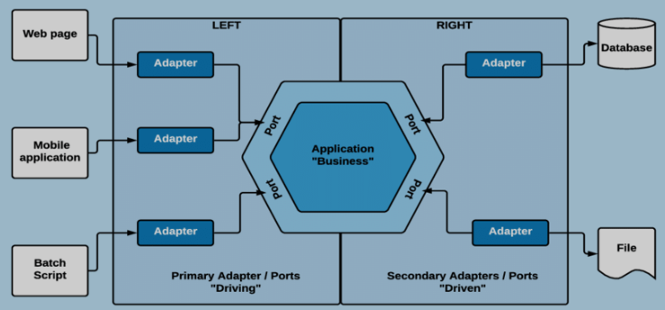

A arquitetura hexagonal, também conhecida como arquitetura de porta e adaptador ou arquitetura de portas limpas (Clean Ports), é um estilo de arquitetura de software que visa criar sistemas altamente desacoplados e independentes de frameworks e tecnologias externas. Ela se baseia no princípio de que a lógica de negócios central de um aplicativo deve ser isolada e independente de detalhes de implementação, como bancos de dados, interfaces de usuário e bibliotecas externas.

Principais conceitos da arquitetura hexagonal:

1. **Hexágono (Núcleo da Aplicação):** No centro da arquitetura hexagonal está o hexágono, que representa a lógica de negócios e as regras essenciais da aplicação. Este é o núcleo da aplicação e é independente de qualquer tecnologia ou interface externa.

2. **Portas:** Portas são interfaces que definem como o hexágono se comunica com o mundo exterior. Existem duas categorias principais de portas:
   - **Portas de Entrada (Inbound Ports):** São interfaces que permitem que dados entrem no hexágono. Isso pode incluir APIs, interfaces de usuário, serviços da web, etc.
   - **Portas de Saída (Outbound Ports):** São interfaces que permitem que o hexágono envie dados para o mundo exterior, como bancos de dados, sistemas externos, serviços de terceiros, etc.

3. **Adaptadores:** Os adaptadores são implementações concretas das portas. Eles traduzem as solicitações e respostas do hexágono para o formato apropriado para interagir com tecnologias externas. Os adaptadores podem ser adaptadores de banco de dados, adaptadores de interface de usuário, adaptadores de serviço da web, etc.

A arquitetura hexagonal promove a separação de preocupações, facilitando a substituição de componentes sem afetar a lógica central da aplicação. Isso torna o sistema mais flexível, testável e adaptável a mudanças. Além disso, a arquitetura hexagonal é particularmente útil em cenários em que a manutenção a longo prazo e a evolução do sistema são prioridades, uma vez que ajuda a evitar acoplamentos indesejados com tecnologias específicas.