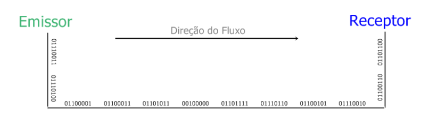
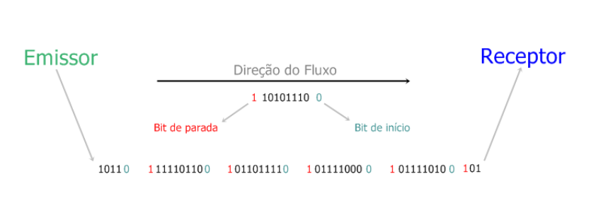

# Introdução aos componentes
## Oque são componentes?
**É a base de uma arquitetura, é a definicição dos componentes que vão compor a arquitetura do software. São todas as coisas que temos em um software que são encapsuladas, isoladas com responsabilidades especificas que se comunicam e compartilham informações atravez dos conectores.**

## Conectores em arquitetura
**Os conectores são responsaveis pela ligação entre componentes. São fundamentais na arquitetura, não são responsaveis somente pela troca de dados entre um componente e outro, mas também, atravez deles, conseguimos medir e ajustar a comunicação entre os componentes, por exemplo o tempo de respota (latência) e tipos de comunicação, por exemplo síncrona e asíncrona**

## métodos de comunicação
* Síncrono
  
  * Em uma comunicação síncrona o emissor e receptor são sincronizados pelo mesmo relógio, o receptor recebe de modo contínuo (mesmo quando nenhum bit é transmitido) os dados em compasso em que o emissor as remete.
* Assíncrona

  * Em uma comunicação assíncrona a sincronização é diferente, o emissor envia o fluxo de dados e periodicamente insere um elemento de sinal, comumente chamado de flag, para que seja possível distinguir aonde começa (a informação de início da transmissão é o start-bit) e acaba (a informação de fim de transmissão é o stop-bit) o bloco de dados e qual a sua posição na sequência de dados transmitidos.

## Tipos de conectores

1. **Conector de Chamada de Procedimento (Procedure Call Connector):** Este é um conector que permite que um componente chame diretamente um procedimento ou função de outro componente. Ele é comumente usado em arquiteturas monolíticas e em sistemas de software que não são distribuídos.

2. **Conector de Comunicação por Mensagens (Message Passing Connector):** Esse tipo de conector permite que os componentes se comuniquem trocando mensagens. É amplamente utilizado em sistemas distribuídos e é uma abordagem comum para a comunicação entre microserviços.

3. **Conector de Chamada Remota (Remote Procedure Call - RPC Connector):** O conector RPC permite que um componente chame uma função ou procedimento em outro componente que pode estar em um local remoto. Isso é comum em sistemas distribuídos e arquiteturas cliente-servidor.

4. **Conector de Chamada Web (Web Service Connector):** Esse conector é usado para permitir a comunicação entre sistemas heterogêneos por meio de padrões da web, como HTTP e XML. É comum em integrações de sistemas e serviços baseados na web.

5. **Conector de Banco de Dados (Database Connector):** Esse tipo de conector permite que os componentes acessem e manipulem dados em um banco de dados. Ele é essencial em sistemas que envolvem armazenamento de dados.

6. **Conector de Filas de Mensagens (Message Queue Connector):** Usado em sistemas assíncronos, esse conector permite que os componentes coloquem mensagens em uma fila e as recuperem posteriormente. É útil para implementar comunicação assíncrona entre componentes.

7. **Conector de Eventos (Event Connector):** Esse conector é usado para transmitir eventos e notificações entre componentes que estão interessados em reagir a eventos específicos. É comum em arquiteturas orientadas a eventos.

8. **Conector de Middleware (Middleware Connector):** O middleware é uma camada de software que facilita a comunicação e a integração entre componentes distribuídos. Esse tipo de conector abstrai muitos detalhes da comunicação de baixo nível e fornece uma interface mais fácil de usar.

9. **Conector de API (API Connector):** Permite que os componentes acessem os serviços e funcionalidades de outros componentes por meio de uma interface de programação de aplicativos (API). É uma abordagem comum em sistemas que incluem serviços de terceiros.

10. **Conector de Socket (Socket Connector):** Usado para comunicação de rede em nível de soquete, permite que os componentes enviem e recebam dados pela rede. É comum em sistemas cliente-servidor e em comunicações de rede de baixo nível.
