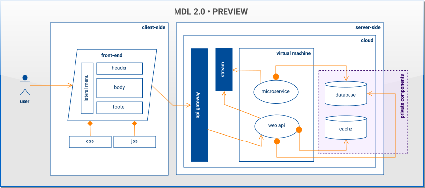
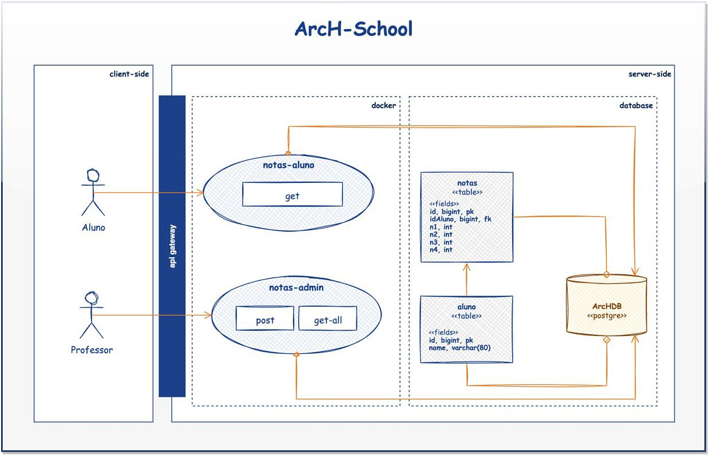

# Diagramas de arquitetura
Diagramas são a linguagem do arquiteto.

# MDL 2.0
MDL é uma notação para diagramas, trata-se uma linguagem para elaborar diagramas.
**O MDL conta com 7 elementos e 1 conector**

1. **Elemento User:** Representa os atores ( usuários, integrações e até mesmo A.Is ) que utilizaram ou farão alguma ação dentro da aplicação.
2. **Elemento Interface:** Qualquer tela ou interface de usuário é representada por esse elemento.
3. **Elemento de Backend:** Todo elemento de CORE, tudo que faz parte do interno da aplicação.
4. **Elemento Database:** Todo elemento relacionado a persistência de dados.
5. **Elemento BlackBox:** Tudo que ficará implicito na aplicação, que não precisamos passar detalhes fica no contexto desse elemento de blackbox.
6. **Elemento Part:** É o elemento que usamos para desenhar camadas, tudo que tiver uma componentização será representado por um elemento part, por exemplo: Um frontend, um serviço, uma integração etc... Usamos para representar infra-estrutura e arquitetura interna.
7. **Elemento Boundary:** Agrupa elementos de maneira contextual, organização etc...

# Conectores
**No MDL só há um conector, a `seta`:** Indica a direção do fluxo da aplicação.
## Possibilidades do Link (`seta`)
 * Link/Cross Link (`-->`) - Conexão entre camadas
 * Always link (`o->`) - Idica que a integração sempre acontece.
 * bi-directional link (`<->`) - Indica nas duas direções.
 * composition link (`--<|>`) Indica um componente faz parte de outro.
 * especialization link - herença (`<--|>`) - Indica que um elemento tem tudo que um outro elemento tem.
 * virtual link (- - - >) Pode indicar qualquer coisa.

# Como funciona um diagrama?

#

